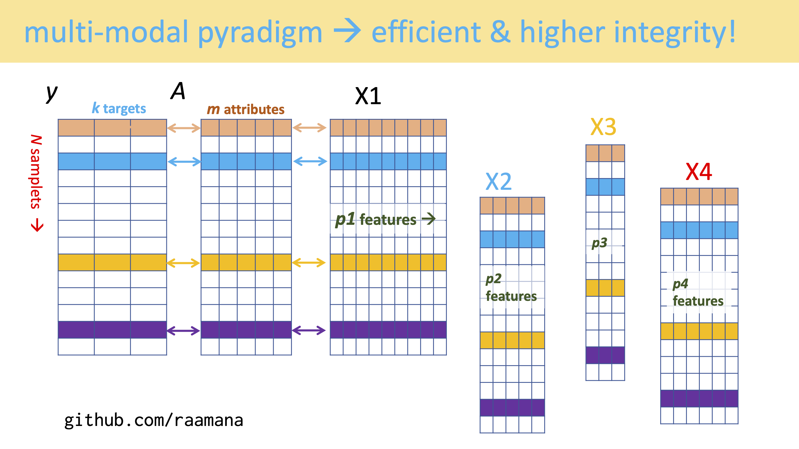

# CSVs suck. Upgrade your life with pyradigm for research data management in biomedical and machine learning applications 

[]

## Documentation

API and usage : http://raamana.github.io/pyradigm/

Demo notebook (no setup required) :

## Schematic

The illustration below describes the full functionality of `pyradigm` in the latest version `0.6`, for which docs will be updated shortly (see below illustration for docs on previous versions):

The value of pyradigm is even more appreciated in the management of multi-modal feature sets, which becomes more efficient and easier to manage.

Usage/demo notebook (no setup required) :

Documentation : http://raamana.github.io/pyradigm/

**Name** : `pyradigm` roughly stands for PYthon based data structure to improve Dataset's InteGrity in Machine learning workflows.

