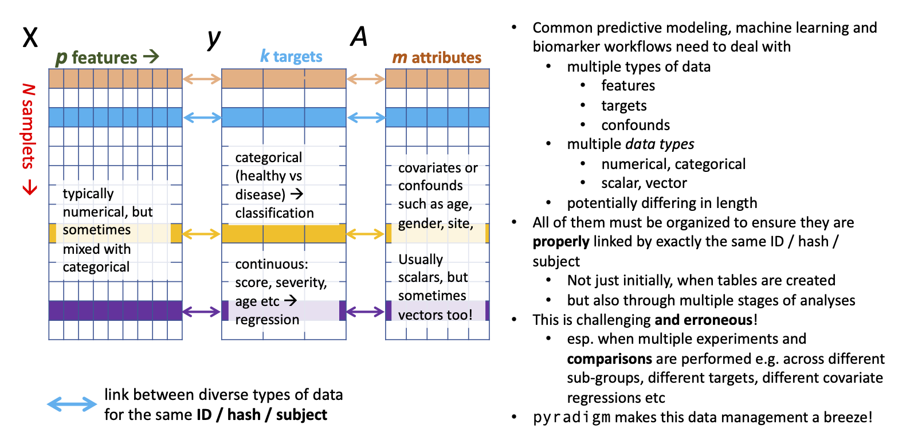

# Pyradigm: PYthon based data structure to improve Dataset's InteGrity in Machine learning workflows

[]

**Upcoming release**: The illustration below describes the full functionality of `pyradigm` in the development version. To access them, clone this repo and install it in a `dev` mode with `pip install -e <cloned_path>`

## DOCS FOR THE CURRENTLY RELEASED VERSION ON PIP, WHICH IS TO BE DEPRECATED SHORTLY 

Usage/demo notebook (no setup required) :

Documentation : http://pyradigm.readthedocs.io

Installation : http://pyradigm.readthedocs.io/docs/installation.html

Usage and examples: http://pyradigm.readthedocs.io/docs/usage.html

Note: requires Python 3 or higher. Python 2 is not supported.

