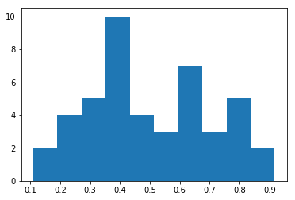

--------
Usage
--------

A tutorial-like example is given in the following Jupyter notebook:

`Pyradigm Example <https://github.com/raamana/pyradigm/blob/master/PyradigmExample.ipynb>`_,

which is reproduced here for your convenience.

Table of Contents

-  Motivation

-  Constructing a dataset

-  Attributes

-  Iteration over samples

-  Subset selection

-  Saving/reloading a dataset (Serialization)

-   Combining multiple datasets and arithmetic on useful subsets within
   datasets

-  Exporting to numpy and portability (e.g. with sklearn)

Illustration of Pyradigm's utility via examples and their use-cases
-------------------------------------------------------------------

This class is greatly suited for neuroimaging applications (or any other
domain), where each sample needs to be uniquely identified with a
subject ID (or something similar).

Key-level correspondence across data, labels (1 or 2), classnames
('healthy', 'disease') and the related helps maintain data integrity and
improve the provenance, in addition to enabling traceback to original
sources from where the features have been originally derived.

Just to given you a concrete examples, let's look at how an ML dataset
is handled traditionally.

You have a matrix X of size n x p, with n samples and p features, and a
vector y containing the target values (or class labels or class
identifiers). This X and y serves as training (and test set) for a
classifier like SVM to fit the data X to match y as accurately as
possible.

Let's get a little more concrete:

.. code-block:: python

    import sys, os
    import numpy as np
    import matplotlib
    %matplotlib
    %matplotlib inline
    import matplotlib.pyplot as plt
    
    n = 10 # number of samples
    p = 3  # number of features
    
    X = np.random.random([n, p]) # random data for illustration
    y = [1]*5 + [2]*5            # random labels ...
    
    np.set_printoptions(precision=2) # save some screen space
    print 'X : \n', X
    print 'y : \n', y

.. code-block:: python

    Using matplotlib backend: TkAgg
    X : 
    [[ 0.64  0.48  0.88]
     [ 0.19  0.05  0.12]
     [ 0.13  0.1   0.68]
     [ 0.99  0.19  0.39]
     [ 0.86  0.36  0.91]
     [ 0.83  0.98  0.32]
     [ 0.86  0.35  0.3 ]
     [ 0.32  0.65  0.83]
     [ 0.6   0.75  0.53]
     [ 0.12  0.52  0.41]]
    y : 
    [1, 1, 1, 1, 1, 2, 2, 2, 2, 2]

Almost all the machine learning toolboxes take their input in this form:
X and y, regardless of the original source that produced these features
in the first place.

This is all fine if all you ever wanted to do is to extract some
features, do some machine learning and dispose these features away!

*\* But this is almost never the case!*\ \*

Because it doesn't simply end there.

At a minimum, I often need to know \* which samples are misclassified -
meaning you need to know what the identifiers are and not simply their
row indices in X? \* what are the charecteristics of those samples? \*
what classes do they belong to?

And all this info needs to be obtained \* without having to write lots
of code connecting few non-obvious links to disparate sources of data
(numerical features X, and sample identifiers in a CSV file) to find the
relevant info \* without having to track down who or which method
originally produced these features \* how the previous personnel or grad
student organized the whole dataset, if you haven't generated the
features yourself from scratch

And if you are like me, you would be thinking about how would you
organize your workflow such that the aforementioned tasks can be
accomplished with ease.

This data structure attempts to accomplish that with ease. By always
organizing the extracted features keyed-in into a dictionary with their
*sample id*, and other important info such as *target values* and other
identified info. This, by definition, preserves the integrity of the
data (inability to incorrectly label samples etc).

No, this data structure doesn't offer the full `provenance
tracking <http://rrcns.readthedocs.io/en/latest/provenance_tracking.html>`_,
which is quite a challenging problem. But it tries make your life a
little easier in your ML workflows.

An example application is shown below, touching upon the following
topics:

-  Motivation

-  Constructing a dataset

-  Attributes

-  Iteration over samples

-  Subset selection

-  Saving/reloading a dataset (Serialization)

-   Combining multiple datasets and arithmetic on useful subsets within
   datasets

-  Exporting to numpy and portability (e.g. with sklearn)

Improting the necessary modules and our fancy class definition:

.. code-block:: python

    from pyradigm import MLDataset

We can now instantiate it and give it a description:

.. code-block:: python

    dataset = MLDataset()
    dataset.description = 'ADNI1 baseline: cortical thickness features from Freesurfer v4.3, QCed.'

.. code-block:: python

    dataset

.. code-block:: python

    ADNI1 baseline: cortical thickness features from Freesurfer v4.3, QCed.
    Empty dataset.

You can see the dataset some description attached to it, however we know
it is empty. This can be verified in a boolean context as shown below:

.. code-block:: python

    bool(dataset)

.. code-block:: python

    False

Let's add samples to this dataset which is when this dataset
implementation becomes really handy. Before we do that, we will define
some convenience routines defined to just illustrate a simple yet common
use of this dataset.

.. highlight:: python

    def read_thickness(path):
        """Dummy function to minic a data reader."""
    
        # in your actural routine, this might be:
        #   pysurfer.read_thickness(path).values()
        return np.random.random(2)
    
    
    def get_features(work_dir, subj_id):
        """Returns the whole brain cortical thickness for a given subject ID."""
    
        # extension to identify the data file; this could be .curv, anything else you choose
        ext_thickness = '.thickness'
    
        thickness = dict()
        for hemi in ['lh', 'rh']:
            path_thickness = os.path.join(work_dir, subj_id, hemi + ext_thickness)
            thickness[hemi] = read_thickness(path_thickness)
    
        # concatenating them to build a whole brain feature set
        thickness_wb = np.concatenate([thickness['lh'], thickness['rh']])
    
        return thickness_wb

So now we have IO routines to read the data for us. Let's define where
the data will come from:

.. code-block:: python

    work_dir = '/project/ADNI/FreesurferThickness_v4p3'
    class_set = ['Cntrl', 'Alzmr', 'MCI']
    class_sizes = [15, 12, 18]

This would obviously change for your applications, but this has
sufficient properties to illustrate the point.

Let's look at what methods this dataset offers us:

.. code-block:: python

    dir(dataset)

.. code-block:: python

    ['add_classes',
     'add_sample',
     'class_set',
     'class_sizes',
     'classes',
     'data',
     'data_and_labels',
     'del_sample',
     'description',
     'extend',
     'get_class',
     'get_feature_subset',
     'get_subset',
     'glance',
     'keys',
     'num_classes',
     'num_features',
     'num_samples',
     'random_subset',
     'random_subset_ids',
     'random_subset_ids_by_count',
     'sample_ids',
     'sample_ids_in_class',
     'save',
     'summarize_classes',
     'train_test_split_ids']

Constructor
-----------

You can see there few methods such as add\_sample, get\_subset etc:
important method being add\_sample, which is key to constructing this
dataset. Let's go ahead and some samples:

.. code-block:: python

    import random
    from datetime import datetime
    random.seed(datetime.now())
    
    def read_target_list(class_name, class_size):
        "Generates a random target list. In reality, you would do something like the commented code below."
        target_list = list()
        for idx in range(class_size):
            target_list.append('{}{:04d}'.format(class_name[0],np.random.randint(1000)))
            
        return target_list
    
    #     target_list_path = os.path.join(work_dir,'scripts','test_sample.{}'.format(class_name))
    #     with open(target_list_path,'r') as tf:
    #         target_list = tf.readlines()
    #         target_list = [sub.strip() for sub in target_list]

.. code-block:: python

    for class_index, class_id in enumerate(class_set):
        print('Working on class {:>5}'.format(class_id))
    
        target_list = read_target_list(class_id,class_sizes[class_index])
        for subj_id in target_list:
            print('\t reading subject {:>15}'.format(subj_id))
            thickness_wb = get_features(work_dir, subj_id)
    
            # adding the sample to the dataset
            dataset.add_sample(subj_id, thickness_wb, class_index, class_id)

.. code-block:: python

    Working on class Cntrl
    	 reading subject           C0102
    	 reading subject           C0589
    	 reading subject           C0246
    	 reading subject           C0776
    	 reading subject           C0483
    	 reading subject           C0622
    	 reading subject           C0547
    	 reading subject           C0296
    	 reading subject           C0981
    	 reading subject           C0782
    	 reading subject           C0767
    	 reading subject           C0451
    	 reading subject           C0065
    	 reading subject           C0592
    	 reading subject           C0665
    Working on class Alzmr
    	 reading subject           A0502
    	 reading subject           A0851
    	 reading subject           A0402
    	 reading subject           A0460
    	 reading subject           A0166
    	 reading subject           A0264
    	 reading subject           A0866
    	 reading subject           A0375
    	 reading subject           A0971
    	 reading subject           A0624
    	 reading subject           A0153
    	 reading subject           A0735
    Working on class   MCI
    	 reading subject           M0450
    	 reading subject           M0207
    	 reading subject           M0647
    	 reading subject           M0752
    	 reading subject           M0037
    	 reading subject           M0171
    	 reading subject           M0173
    	 reading subject           M0733
    	 reading subject           M0551
    	 reading subject           M0698
    	 reading subject           M0256
    	 reading subject           M0642
    	 reading subject           M0924
    	 reading subject           M0543
    	 reading subject           M0751
    	 reading subject           M0950
    	 reading subject           M0143
    	 reading subject           M0670

**Nice. Isn't it?**

So what's nice about this, you say? *The simple fact that you are
constructing a dataset as you read the data* in its most elemental form
(in the units of the dataset such as the subject ID in our neuroimaging
application). You're done as soon as you're done reading the features
from disk.

What's more - you can inspect the dataset in an intuitive manner, as
shown below:

.. code-block:: python

    dataset

.. code-block:: python

    ADNI1 baseline: cortical thickness features from Freesurfer v4.3, QCed.
    45 samples and 4 features.
    Class Cntrl : 15 samples.
    Class   MCI : 18 samples.
    Class Alzmr : 12 samples.

Even better, right? No more too much typing of several commands to get
the complete and concise sense of the dataset.

Convenient attributes
---------------------

If you would like, you can always get more specific information, such
as:

.. code-block:: python

    dataset.num_samples

.. code-block:: python

    45

.. code-block:: python

    dataset.num_features

.. code-block:: python

    4

.. code-block:: python

    dataset.class_set

.. code-block:: python

    ['Cntrl', 'MCI', 'Alzmr']

.. code-block:: python

    dataset.class_sizes

.. code-block:: python

    Counter({'Alzmr': 12, 'Cntrl': 15, 'MCI': 18})

.. code-block:: python

    dataset.class_sizes['Cntrl']

.. code-block:: python

    15

If you'd like to take a look data inside for few subjects - shall we
call it a glance?

.. code-block:: python

    dataset.glance()

.. code-block:: python

    {'C0102': array([ 0.06,  0.16,  0.8 ,  0.9 ]),
     'C0246': array([ 0.93,  0.91,  0.09,  0.62]),
     'C0483': array([ 0.27,  0.97,  0.84,  0.63]),
     'C0589': array([ 0.34,  0.06,  0.33,  0.24]),
     'C0776': array([ 0.67,  0.06,  0.08,  0.03])}

We can control the number of items to glance, by passing a number to
dataset.glance() method:

.. code-block:: python

    dataset.glance(2)

.. code-block:: python

    {'C0102': array([ 0.06,  0.16,  0.8 ,  0.9 ]),
     'C0589': array([ 0.34,  0.06,  0.33,  0.24])}

Or you may be wondering what are the subject IDs in the dataset.. here
they are:

.. code-block:: python

    dataset.sample_ids

.. code-block:: python

    ['C0102',
     'C0589',
     'C0246',
     'C0776',
     'C0483',
     'C0622',
     'C0547',
     'C0296',
     'C0981',
     'C0782',
     'C0767',
     'C0451',
     'C0065',
     'C0592',
     'C0665',
     'A0502',
     'A0851',
     'A0402',
     'A0460',
     'A0166',
     'A0264',
     'A0866',
     'A0375',
     'A0971',
     'A0624',
     'A0153',
     'A0735',
     'M0450',
     'M0207',
     'M0647',
     'M0752',
     'M0037',
     'M0171',
     'M0173',
     'M0733',
     'M0551',
     'M0698',
     'M0256',
     'M0642',
     'M0924',
     'M0543',
     'M0751',
     'M0950',
     'M0143',
     'M0670']

Iteration over samples
----------------------

Thanks to its dictionary based implementation, data for a given sample
'007\_S\_1248' can simply be obtained by:

.. code-block:: python

    sample_id = dataset.sample_ids[20]
    print sample_id, dataset.data[sample_id]

.. code-block:: python

    A0264 [ 0.63  0.14  0.23  0.15]

we can easily iterate over all the samples to obtain their data as well
as class labels. Let's see it in action:

.. code-block:: python

    for sample, features in dataset.data.items():
        print "{} : {:>10} : {}".format(sample, dataset.classes[sample], features)

.. code-block:: python

    C0102 :      Cntrl : [ 0.06  0.16  0.8   0.9 ]
    C0589 :      Cntrl : [ 0.34  0.06  0.33  0.24]
    C0246 :      Cntrl : [ 0.93  0.91  0.09  0.62]
    C0776 :      Cntrl : [ 0.67  0.06  0.08  0.03]
    C0483 :      Cntrl : [ 0.27  0.97  0.84  0.63]
    C0622 :      Cntrl : [ 0.4   0.53  0.08  0.53]
    C0547 :      Cntrl : [ 0.66  0.49  0.45  0.68]
    C0296 :      Cntrl : [ 0.32  0.33  0.21  0.52]
    C0981 :      Cntrl : [ 0.51  0.09  0.93  0.91]
    C0782 :      Cntrl : [ 0.12  0.42  0.2   0.65]
    C0767 :      Cntrl : [ 0.59  0.18  0.26  0.77]
    C0451 :      Cntrl : [ 0.2   0.08  0.25  0.18]
    C0065 :      Cntrl : [ 1.    0.56  0.71  0.6 ]
    C0592 :      Cntrl : [ 0.05  0.48  0.28  0.57]
    C0665 :      Cntrl : [ 0.87  0.07  0.62  0.68]
    A0502 :      Alzmr : [ 0.57  0.69  0.23  0.17]
    A0851 :      Alzmr : [ 0.06  0.71  0.86  0.66]
    A0402 :      Alzmr : [ 0.9   0.54  0.6   0.2 ]
    A0460 :      Alzmr : [ 0.75  0.71  0.19  0.46]
    A0166 :      Alzmr : [ 0.14  0.54  0.01  0.09]
    A0264 :      Alzmr : [ 0.63  0.14  0.23  0.15]
    A0866 :      Alzmr : [ 0.55  0.5   0.97  0.13]
    A0375 :      Alzmr : [ 0.89  0.66  0.53  0.44]
    A0971 :      Alzmr : [ 0.41  0.86  0.86  0.58]
    A0624 :      Alzmr : [ 0.74  0.01  0.13  0.41]
    A0153 :      Alzmr : [ 0.82  0.37  0.81  0.52]
    A0735 :      Alzmr : [ 0.79  0.02  0.59  0.57]
    M0450 :        MCI : [ 0.04  0.51  0.44  0.44]
    M0207 :        MCI : [ 0.76  0.65  0.53  0.43]
    M0647 :        MCI : [ 0.63  0.07  0.41  0.62]
    M0752 :        MCI : [ 0.3   0.92  0.64  0.64]
    M0037 :        MCI : [ 0.07  0.82  0.57  0.39]
    M0171 :        MCI : [ 0.38  0.43  0.22  0.22]
    M0173 :        MCI : [ 0.74  0.81  0.63  0.33]
    M0733 :        MCI : [ 0.64  0.93  0.13  0.13]
    M0551 :        MCI : [ 0.79  0.03  0.28  0.29]
    M0698 :        MCI : [ 1.    0.54  0.71  0.72]
    M0256 :        MCI : [ 0.26  0.58  0.24  0.44]
    M0642 :        MCI : [ 0.16  0.93  0.74  0.44]
    M0924 :        MCI : [ 0.39  0.41  0.25  0.19]
    M0543 :        MCI : [ 0.83  0.51  0.06  0.86]
    M0751 :        MCI : [ 0.11  0.38  0.55  0.57]
    M0950 :        MCI : [ 0.77  1.    0.03  0.54]
    M0143 :        MCI : [ 0.84  0.12  0.94  0.9 ]
    M0670 :        MCI : [ 0.57  0.72  0.97  0.33]

Thanks to the choice of the OrderedDict() for each of the data, classes
and labels, the order of sample addition is retained. Hence the
correspondence across samples in the dataset not only key-wise (by the
sample id), but also index-wise.

Another example to illustrate how one can access the subset of features
e.g. cortical thickness for a particular region of interest (say
posterior cingulate gyrus) is below:

.. code-block:: python

    # let's make a function to return the indices for the ROI
    def get_ROI_indices(ctx_label=None):
        if ctx_label == 'post_cingulate_gyrus':
            return xrange(2) # dummy for now
        else:
            return xrange(dataset.num_features) # all the features

Now the following code iterates over each sample and prints the average
cortical thickness in the specific ROI:

.. code-block:: python

    avg_thickness = dict()
    for sample, features in dataset.data.items():
        avg_thickness[sample] = np.mean(features[get_ROI_indices('post_cingulate_gyrus')])
        print "{} {:>10}  {:.2f}".format(sample, dataset.classes[sample], avg_thickness[sample] )

.. code-block:: python

    C0102      Cntrl  0.11
    C0589      Cntrl  0.20
    C0246      Cntrl  0.92
    C0776      Cntrl  0.36
    C0483      Cntrl  0.62
    C0622      Cntrl  0.46
    C0547      Cntrl  0.58
    C0296      Cntrl  0.32
    C0981      Cntrl  0.30
    C0782      Cntrl  0.27
    C0767      Cntrl  0.39
    C0451      Cntrl  0.14
    C0065      Cntrl  0.78
    C0592      Cntrl  0.27
    C0665      Cntrl  0.47
    A0502      Alzmr  0.63
    A0851      Alzmr  0.39
    A0402      Alzmr  0.72
    A0460      Alzmr  0.73
    A0166      Alzmr  0.34
    A0264      Alzmr  0.38
    A0866      Alzmr  0.52
    A0375      Alzmr  0.77
    A0971      Alzmr  0.63
    A0624      Alzmr  0.37
    A0153      Alzmr  0.60
    A0735      Alzmr  0.41
    M0450        MCI  0.27
    M0207        MCI  0.71
    M0647        MCI  0.35
    M0752        MCI  0.61
    M0037        MCI  0.44
    M0171        MCI  0.40
    M0173        MCI  0.77
    M0733        MCI  0.78
    M0551        MCI  0.41
    M0698        MCI  0.77
    M0256        MCI  0.42
    M0642        MCI  0.54
    M0924        MCI  0.40
    M0543        MCI  0.67
    M0751        MCI  0.25
    M0950        MCI  0.88
    M0143        MCI  0.48
    M0670        MCI  0.64

Let's make a bar plot with the just computed numbers:

.. code-block:: python

    avg_thickness.values()

.. code-block:: python

    [0.77419317627756634,
     0.274568477535865,
     0.52456600133438958,
     0.10988851639242048,
     0.9173077195848538,
     0.67215738787506218,
     0.78073124498823832,
     0.34319836534987225,
     0.36466613282060334,
     0.40681014189609904,
     0.77075603570250351,
     0.2672873843477836,
     0.3979586538904154,
     0.41057586141404956,
     0.24687851327074922,
     0.54467083900315094,
     0.63490203247374355,
     0.26986173065211588,
     0.35136691981491958,
     0.38601865045543871,
     0.57797853866707183,
     0.60791732543673671,
     0.41977590274138665,
     0.77760363600740945,
     0.13930958880564798,
     0.37157580525743594,
     0.47605248855507931,
     0.70524233745725029,
     0.59765881251299779,
     0.71813681129356643,
     0.47074880969405297,
     0.38743449904671035,
     0.46419007761963849,
     0.6215589295056978,
     0.1986440118547006,
     0.29957866524180221,
     0.32234483765792193,
     0.7273392116680899,
     0.63002920038567556,
     0.88383304529760121,
     0.40282387477340864,
     0.44243699049296453,
     0.77499920202425088,
     0.38313913682247508,
     0.64471408195318269]

.. code-block:: python

    n, bins, patches = plt.hist(avg_thickness.values())

Remember as the original source of data was random, this has no units,
property or meaning!

Subset selection
----------------

In addition to the structured way of obtaining the various properties of
this dataset, this implementation really will come in handy when you
have to slice and dice the dataset (with large number of classes and
features) into smaller subsets (e.g. for binary classification). Let's
see how we can retrieve the data for a single class:

.. code-block:: python

    ctrl = dataset.get_class('Cntrl')

That's it, obtaining the data for a given class is a simple call away.

Now let's see what it looks like:

.. code-block:: python

    ctrl

.. code-block:: python

    
     Subset derived from: ADNI1 baseline: cortical thickness features from Freesurfer v4.3, QCed.
    15 samples and 4 features.
    Class Cntrl : 15 samples.

Even with updated description automatically, to indicate its history.
Let's see some data from controls:

.. code-block:: python

    ctrl.glance(2)

.. code-block:: python

    {'C0102': array([ 0.06,  0.16,  0.8 ,  0.9 ]),
     'C0589': array([ 0.34,  0.06,  0.33,  0.24])}

We can also query a random subset of samples for manual inspection or
cross-validation purposes. For example:

.. code-block:: python

    random_subset = dataset.random_subset(perc_in_class=0.3)
    random_subset

.. code-block:: python

    
     Subset derived from: ADNI1 baseline: cortical thickness features from Freesurfer v4.3, QCed.
    12 samples and 4 features.
    Class Cntrl : 4 samples.
    Class   MCI : 5 samples.
    Class Alzmr : 3 samples.

You can see which samples were selected:

.. code-block:: python

    random_subset.sample_ids

.. code-block:: python

    ['C0296',
     'C0981',
     'C0592',
     'C0665',
     'A0402',
     'A0460',
     'A0866',
     'M0207',
     'M0752',
     'M0924',
     'M0543',
     'M0143']

You can verify that it is indeed random by issuing another call:

.. code-block:: python

    # supplying a new seed everytime to ensure randomization
    from datetime import datetime
    dataset.random_subset(perc_in_class=0.3).sample_ids

.. code-block:: python

    ['C0102',
     'C0589',
     'C0547',
     'C0767',
     'A0851',
     'A0166',
     'A0375',
     'M0450',
     'M0207',
     'M0551',
     'M0698',
     'M0751']

Let's see how we can retrieve specific samples by their IDs (for which there are many use cases):
^^^^^^^^^^^^^^^^^^^^^^^^^^^^^^^^^^^^^^^^^^^^^^^^^^^^^^^^^^^^^^^^^^^^^^^^^^^^^^^^^^^^^^^^^^^^^^^^^

.. code-block:: python

    data = dataset.get_subset(dataset.sample_ids[1:20])
    data

.. code-block:: python

    
     Subset derived from: ADNI1 baseline: cortical thickness features from Freesurfer v4.3, QCed.
    19 samples and 4 features.
    Class Cntrl : 14 samples.
    Class Alzmr : 5 samples.

So as simple as that.

Cross-validation
================

If you would like to develop a variant of cross-validation, and need to
obtain a random split of the dataset to obtain training and test sets,
it is as simple as:

.. code-block:: python

    train_set, test_set = dataset.train_test_split_ids( train_perc = 0.5)

This method returns two sets of sample ids corresponding to training set
(which 50% of samples from all classes in the dataset) and the rest in
test\_set. Let's see what they have:

.. code-block:: python

    train_set, test_set

.. code-block:: python

    (['C0592',
      'C0622',
      'C0782',
      'C0776',
      'C0451',
      'C0483',
      'C0981',
      'M0752',
      'M0173',
      'M0543',
      'M0642',
      'M0751',
      'M0256',
      'M0207',
      'M0143',
      'M0924',
      'A0851',
      'A0402',
      'A0502',
      'A0971',
      'A0264',
      'A0624'],
     ['M0450',
      'A0866',
      'C0102',
      'C0246',
      'M0733',
      'A0166',
      'M0551',
      'M0698',
      'A0735',
      'M0647',
      'C0547',
      'C0065',
      'A0153',
      'C0665',
      'C0767',
      'C0589',
      'C0296',
      'A0460',
      'A0375',
      'M0171',
      'M0950',
      'M0037',
      'M0670'])

We can also get a train/test split by specifying an exact number of
subjects we would like from each class (e.g. when you would like to
avoid class imbalance in the training set):

.. code-block:: python

    train_set, test_set = dataset.train_test_split_ids( count_per_class = 3)

Let's see what the training set contains - we expect 3\*3 =9 subjects :

.. code-block:: python

    train_set

.. code-block:: python

    ['C0776',
     'C0065',
     'C0483',
     'M0173',
     'M0752',
     'M0698',
     'A0166',
     'A0624',
     'A0460']

We can indeed verify that is the case, by creating a new smaller dataset
from that list of ids and getting a summary:

.. code-block:: python

    training_dataset = dataset.get_subset(train_set)
    training_dataset

.. code-block:: python

    
     Subset derived from: ADNI1 baseline: cortical thickness features from Freesurfer v4.3, QCed.
    9 samples and 4 features.
    Class Cntrl : 3 samples.
    Class   MCI : 3 samples.
    Class Alzmr : 3 samples.

Another programmatic way to look into different classes is this:

.. code-block:: python

    class_set, label_set, class_sizes = training_dataset.summarize_classes()
    class_set, label_set, class_sizes

.. code-block:: python

    (['Cntrl', 'MCI', 'Alzmr'], [0, 2, 1], array([ 3.,  3.,  3.]))

which returns all the classes that you could iterative over.

Using these two lists, we can easily obtain subset datasets, as
illustrated below.

.. code-block:: python

    dataset

.. code-block:: python

    ADNI1 baseline: cortical thickness features from Freesurfer v4.3, QCed.
    45 samples and 4 features.
    Class Cntrl : 15 samples.
    Class   MCI : 18 samples.
    Class Alzmr : 12 samples.

.. code-block:: python

    binary_dataset = dataset.get_class(['Cntrl','Alzmr'])
    binary_dataset

.. code-block:: python

    
     Subset derived from: ADNI1 baseline: cortical thickness features from Freesurfer v4.3, QCed.
    27 samples and 4 features.
    Class Cntrl : 15 samples.
    Class Alzmr : 12 samples.

How about selecting a subset of features from all samples?

.. code-block:: python

    binary_dataset.get_feature_subset(xrange(2))

.. code-block:: python

    Subset features derived from: 
     
     Subset derived from: ADNI1 baseline: cortical thickness features from Freesurfer v4.3, QCed.
    27 samples and 2 features.
    Class Cntrl : 15 samples.
    Class Alzmr : 12 samples.

**Great.** Isn't it? You can also see the two-time-point history
(initial subset in classes, followed by a subset in features).

Serialization
-------------

Once you have this dataset, you can save and load these trivially using
your favourite serialization module. Let's do some pickling:

.. code-block:: python

    out_file = os.path.join(work_dir,'binary_dataset_Ctrl_Alzr_Freesurfer_thickness_v4p3.pkl')
    binary_dataset.save(out_file)

That's it - it is saved.

Let's reload it from disk and make sure we can indeed retrieve it:

.. code-block:: python

    reloaded = MLDataset(filepath=out_file) # another form of the constructor!

.. code-block:: python

    Loading the dataset from: /project/ADNI/FreesurferThickness_v4p3/binary_dataset_Ctrl_Alzr_Freesurfer_thickness_v4p3.pkl

.. code-block:: python

    reloaded

.. code-block:: python

    
     Subset derived from: ADNI1 baseline: cortical thickness features from Freesurfer v4.3, QCed.
    27 samples and 4 features.
    Class Cntrl : 15 samples.
    Class Alzmr : 12 samples.

Dataset Arithmetic
------------------

You might wonder how can you combine two different types of features (
thickness and shape ) from the dataset. Piece of cake, see below ...

To concatenat two datasets, first we make a second dataset:

.. code-block:: python

    dataset_two = MLDataset(in_dataset=dataset) # yet another constructor: in its copy form!

How can you check if they are "functionally identical"? As in same keys,
same data and classes for each key... Easy:

.. code-block:: python

    dataset_two == dataset

.. code-block:: python

    True

Now let's try the arithmentic:

.. code-block:: python

    combined = dataset + dataset_two

.. code-block:: python

    Identical keys found. Trying to horizontally concatenate features for each sample.

Great. The add method recognized the identical set of keys and performed
a horiz cat, as can be noticed by the twice the number of features in
the combined dataset:

.. code-block:: python

    combined

.. code-block:: python

    
    45 samples and 8 features.
    Class Cntrl : 15 samples.
    Class   MCI : 18 samples.
    Class Alzmr : 12 samples.

We can also do some removal in similar fashion:

.. code-block:: python

    smaller = combined - dataset

.. code-block:: python

    C0102 removed.
    C0589 removed.
    C0246 removed.
    C0776 removed.
    C0483 removed.
    C0622 removed.
    C0547 removed.
    C0296 removed.
    C0981 removed.
    C0782 removed.
    C0767 removed.
    C0451 removed.
    C0065 removed.
    C0592 removed.
    C0665 removed.
    A0502 removed.
    A0851 removed.
    A0402 removed.
    A0460 removed.
    A0166 removed.
    A0264 removed.
    A0866 removed.
    A0375 removed.
    A0971 removed.
    A0624 removed.
    A0153 removed.
    A0735 removed.
    M0450 removed.
    M0207 removed.
    M0647 removed.
    M0752 removed.
    M0037 removed.
    M0171 removed.
    M0173 removed.
    M0733 removed.
    M0551 removed.
    M0698 removed.
    M0256 removed.
    M0642 removed.
    M0924 removed.
    M0543 removed.
    M0751 removed.
    M0950 removed.
    M0143 removed.
    M0670 removed.

Data structure is even producing a warning to let you know the resulting
output would be empty! We can verify that:

.. code-block:: python

    bool(smaller)

.. code-block:: python

    False

Portability
-----------

This is all well and good. How does it interact with other packages out
there, you might ask? It is as simple as you can imagine:

.. code-block:: python

    from sklearn import svm
    clf = svm.SVC(gamma=0.001, C=100.)
    data_matrix, target, sample_ids = binary_dataset.data_and_labels()

.. code-block:: python

    clf.fit(data_matrix, target)

.. code-block:: python

    SVC(C=100.0, cache_size=200, class_weight=None, coef0=0.0,
      decision_function_shape=None, degree=3, gamma=0.001, kernel='rbf',
      max_iter=-1, probability=False, random_state=None, shrinking=True,
      tol=0.001, verbose=False)

There you have it, a simple example to show you the utility and
convenience of this dataset.

Thanks for checking it out.
~~~~~~~~~~~~~~~~~~~~~~~~~~~

I would appreciate if you could give me feedback on improving or sharpening it further.
~~~~~~~~~~~~~~~~~~~~~~~~~~~~~~~~~~~~~~~~~~~~~~~~~~~~~~~~~~~~~~~~~~~~~~~~~~~~~~~~~~~~~~~
